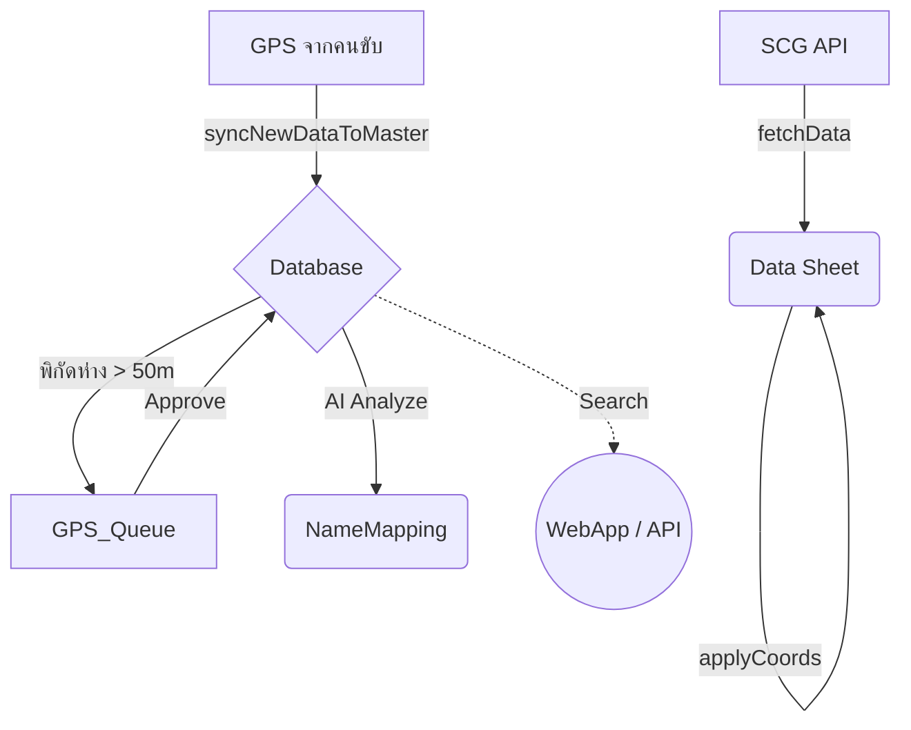

# 🚛 Logistics Master Data System (LMDS) — V4.2


ระบบจัดการฐานข้อมูล Logistics อัจฉริยะ สำหรับ **SCG JWD** พัฒนาด้วย Google Apps Script ทำหน้าที่จัดการ Master Data ลูกค้า, ประมวลผลพิกัด GPS, นำเข้าข้อมูลการจัดส่งจาก SCG, จัดการคิวพิกัด และรองรับระบบค้นหาด้วย AI ผ่าน WebApp

---

## ✨ ความสามารถเด่นของระบบ (Key Features)

- **Master Data Governance:** จัดการฐานข้อมูลหลักอย่างเป็นระบบ (22 คอลัมน์) พร้อมระบบนามแฝง (Alias) ในชีต `NameMapping` 
- **Automated Sync & SCG API:** ดึงข้อมูล Shipment จาก SCG และเทียบพิกัดจุดส่งสินค้าให้อัตโนมัติลงในชีต `Data`
- **GPS Queue & Feedback:** กักเก็บและรอการตรวจสอบพิกัดที่ต่างกัน (Threshold > 50m) ก่อนแอดมินกด Approve เพื่อเขียนทับ DB
- **Smart Search & WebApp:** ระบบค้นหาข้อมูลลูกค้าและพิกัดผ่าน `doGet`/`doPost` หน้าตา Web UI ทันสมัย
- **AI Resolution (Gemini):** ทำ AI Indexing สร้าง Keywords เพื่อให้การค้นหาครอบคลุมตัวสะกดผิด พร้อมวิเคราะห์จับคู่พิกัดแบบ AI
- **System Diagnostics:** มีเมนูเช็คสุขภาพฐานข้อมูล, Schema, โควต้า และระบบ Dry-run อย่างปลอดภัย

---

## 📐 โครงสร้างการไหลของข้อมูล (System Data Flow)



---

## 📁 โครงสร้างโมดูล (Architecture)
ระบบประกอบด้วย 21 ไฟล์ที่แบ่งหน้าที่ทำงานตามหลัก **Separation of Concerns** 

### 1. Configuration & Utilities
| ไฟล์ | หน้าที่ |
|---|---|
| `Config.gs` | ค่าคงที่ของระบบ, คอลัมน์ index (DB:22, MAP:5), ตั้งค่า SCG และระบบ AI |
| `Utils_Common.gs` | ฟังก์ชัน Helper เช่น normalizeText, generateUUID, คำนวณ Haversine, Adapter การดึง Object |

### 2. Core Services (บริการหลัก)
| ไฟล์ | หน้าที่ |
|---|---|
| `Service_Master.gs` | ระบบ Sync เข้า Database, จัดการ Clustering, คัดแยกและ Clean Data |
| `Service_SCG.gs` | ตัวดึง API ดึงข้อมูล Shipment รายวัน, ผูก Email, และทำ Summary Report |
| `Service_GeoAddr.gs` | เชื่อมต่อ Google Maps, แปลงที่อยู่, และระบบ Cache รหัสไปรษณีย์ |
| `Service_Search.gs` | Engine ประมวลผลและแคชเพื่อส่งข้อมูลแสดงที่หน้า WebApp |

### 3. Data Governance (ความปลอดภัยและควบคุมคุณภาพ)
| ไฟล์ | หน้าที่ |
|---|---|
| `Service_SchemaValidator.gs`| ตัวตรวจสอบโครงสร้างตารางก่อนรันระบบ ป้องกันคอลัมน์ล่ม |
| `Service_GPSFeedback.gs` | ดูแลจัดการ `GPS_Queue` กักกันความคลาดเคลื่อนพิกัดให้มนุษย์ตัดสิน |
| `Service_SoftDelete.gs` | ระบบรวมรหัส UUID ซ้ำ โดยคงข้อมูลในสถานะ `Inactive` หรือ `Merged` |

### 4. AI, Automation & Notifications
| ไฟล์ | หน้าที่ |
|---|---|
| `Service_Agent.gs` | ระบบ AI สมองกล (Tier 4) เคลียร์รายชื่อตกหล่น |
| `Service_AutoPilot.gs` | Time-driven Trigger ควบคุมบอทรัน Routine ทุก 10 นาที |
| `Service_Notify.gs` | Hub ระบบแจ้งเตือนทาง LINE Notify และ Telegram |

### 5. Setup, Test & Maintenance
| ไฟล์ | หน้าที่ |
|---|---|
| `Setup_Security.gs` | พื้นที่ใส่คีย์ต่างๆ เซฟเก็บใน Script Properties ไม่ให้หลุด |
| `Setup_Upgrade.gs` | ช่วยตั้งโครงตาราง เพิ่ม/อัพเกรดฟิลด์ แบะค้นหา Hidden Duplicates |
| `Service_Maintenance.gs` | จัดการไฟล์สำรองอัตโนมัติ (> 30 วัน), เตือนเมื่อพื้นที่เกือบเต็ม 10M Cells |
| `Test_Diagnostic.gs` | สคริปต์สแกนตรวจสอบ Dry Run ระบบและ UUID ให้ออกมาเป็น Report |
| `Test_AI.gs` | โมดูลตรวจ Debug เช็ค connection Google Gemini API |

### 6. User Interface & API 
| ไฟล์ | หน้าที่ |
|---|---|
| `Menu.gs` | อินเทอร์เฟซสร้าง Custom Menus สำหรับแอดมินใน Google Sheets |
| `WebApp.gs` | ตัว Routing สำหรับเปิด Web Application (`doGet`) หรือรับ Webhook (`doPost`) |
| `Index.html` | ตัวประมวลหน้า Web frontend พร้อมการโชว์ป้ายกำกับ Badge ข้อมูลพิกัด |

---

## 🗂️ ชีตที่ระบบต้องใช้งาน (Spreadsheet Setup)
กรุณาตั้งชื่อแท็บให้ตรงเป๊ะ ระบบจึงจะทำงานได้สมบูรณ์:

1. **`Database`**: แหล่งอ้างอิงกลาง (Golden Record) มี 22 คอลัมน์ถึง `Merged_To_UUID`
2. **`NameMapping`**: แหล่งคำพ้อง 5 คอลัมน์ 
3. **`SCGนครหลวงJWDภูมิภาค`**: ฐานรองรับ Source ของพิกัด O(LAT) และ P(LONG) + คอลัมน์ AK(`SYNC_STATUS`)
4. **`Data`**: ใช้ 29 คอลัมน์ รับ API วันปัจจุบัน และ `AA=LatLong_Actual`
5. **`Input`**: เซลล์ `B1` วางคุกกี้ และ `A4↓` รายการเลข Shipment 
6. **`GPS_Queue`**: รอการ Approve/Reject (คอลัมน์ H และ I)
7. **`PostalRef`**: สำหรับค้นหา Postcode 
8. **`ข้อมูลพนักงาน`**: แหล่งรวมรหัสพนักงาน สำหรับทำ Match นำอีเมลมาลงรายงาน

---

## 🚀 ขั้นตอนการติดตั้งครั้งแรก (Installation)

1. เปิด **Google Spreadsheet** > Extension > Apps Script
2. คัดลอกและสร้างไฟล์นามสกุล `.gs` และ `Index.html` ตามหัวข้อด้านบน นำลงวางให้ครบ
3. เปลี่ยนชื่อชีตทั้งหมด (Sheets Tabs) ให้ครบตาม 8 แท็บข้างต้น 
4. เลือกรันฟังก์ชัน **`setupEnvironment()`** จาก `Setup_Security.gs` เพื่อกรอกคีย์ `Gemini API`
5. หากยังไม่มีคิว GPS ให้รัน **`createGPSQueueSheet()`** โครงสร้างตารางรออนุมัติจะโผล่ขึ้นทันที
6. เลือกรัน **`runFullSchemaValidation()`** เพื่อให้สคริปต์ตรวจความพร้อมของระบบ
7. รัน **`initializeRecordStatus()`** ครั้งแรก เพื่อประทับตราสถานะลูกค้าดั้งเดิม
8. โหลดรีเฟรชหน้าชีต (F5) เมนู Custom "Logistics Master Data" จะปรากฏขึ้น พร้อมรันระบบ!
9. นำไปทำ Web App กด Deploy (Execute as: Me, Access: Anyone) เพื่อเอา Link ไปค้นหา

---

## 📅 กระบวนการทำงานประจำวัน (Daily Operations)

1. **SCG Import:** 
   ใส่เลขที่ช่อง Input แอดมินคลิกที่เมนู > `โหลดข้อมูล Shipment (+E-POD)`
2. **เทียบ Master Coord:**
   สคริปต์สั่งยิงพิกัดเทียบตารางจาก DB มาใส่ช่องรายวันด้วย `applyMasterCoordinatesToDailyJob()`
3. **จัดหาชื่อและพิกัดลูกค้าที่เพิ่มมาใหม่:**
   เข้าเมนู `1️⃣ ดึงลูกค้าใหม่ (Sync New Data)` เพื่อรวบยอด SCG ล่าสุดมาชนคลังแม่
4. **ปะทุงาน Admin ปิดจ็อบพิกัดต่างกัน (GPS Diff):**
   แอดมินเคลียร์ติ๊ก ✔️ช่อง Approve และเข้าเมนูกด **`✅ 2. อนุมัติรายการที่ติ๊กแล้ว`**
5. **วิเคราะห์นามลูกค้าใหม่ (ตกค้าง):**
   แอดมินคลิกที่ `🧠 4️⃣ ส่งชื่อแปลกให้ AI วิเคราะห์` หรือปล่อย AutoPilot ทิ้งไว้ข้ามคืน
6. **สแตนด์บายหาพิกัดได้เลย**: 
   ให้คนขับค้นหาสิ่งต่างๆ ผ่านลิงก์ WebApp ของโปรเจคนี้

---

## 📡 Webhook API (`doPost` / `doGet`)
นอกจากใช้แสดงผล HTML คุณสามารถต่อยิง Payload จากแอพนอกแบบ `JSON POST` มารองรับด้วย Actions:

```json
{ 
  "action": "triggerAIBatch" 
}
// Actions Available: 
// 1) "triggerAIBatch"  2) "triggerSync"  3) "healthCheck"
```

---

## 🐛 มีอะไรใหม่ใน V4.1 - 4.2 ? (Changelogs)
- **Soft Delete Features:** การ Merge ตัวแปรจะใช้การรัน UUID สายพาน ทับสิทธ์แต่ไม่ลบประวัติ `MERGED_TO_UUID`
- **Schema Watchdog:** ป้องกันตารางพังแบบรันก่อนตาย `validateSchemas()` ทำงานแบบด่านหน้ากักกันความผิดพลาด
- **Bug Fixed (Critical):** แก้อาการอ้างแถวผีสิงที่ CheckBox (`getRealLastRow_`), แก้นับอีพอด `checkIsEPOD` คลาดเคลื่อน, กำจัดการดึง API จน Google ล็อกโควต้าเกินความจำแบนแบบ bytes Cache
- **Data Index Refactoring:** ตัดค่าลอย ฮาร์ดโค้ดเป็นระบบ Configuration กลาง เปลี่ยนความตายของการนับตัวเลข อาเรย์ Array
